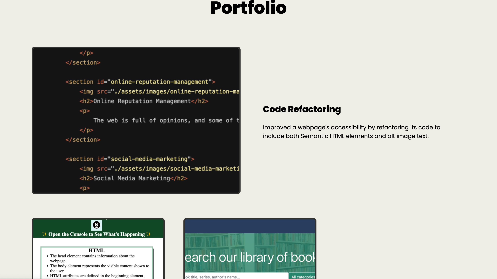

# Unit 1 Challenge: Code Refactor

## Description

A web development portfolio webpage, with some information about myself and some of the deployed pages/apps I've built so far.

The intention behind the webpage is to showcase my Web Dev skills.

In working on this portfolio, I practised and developed using CSS flexbox and grid towards a goal.

## Installation

N/A

## Usage

This webpage can be accessed and perused via a web browser. Included on the page are links that take the user to the corresponding place. The website should be responsive to differently sized screens. Screenshots of how it should look on a desktop is shown below.

## Credits

N/A

## License

Licensed under the [MIT](https://opensource.org/licenses/MIT) license.

## Badges

